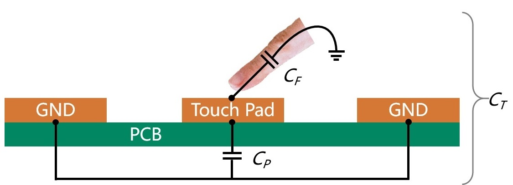
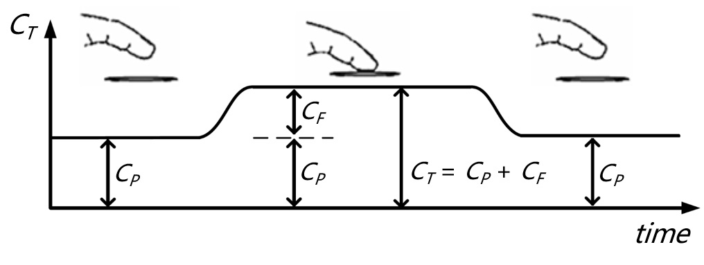
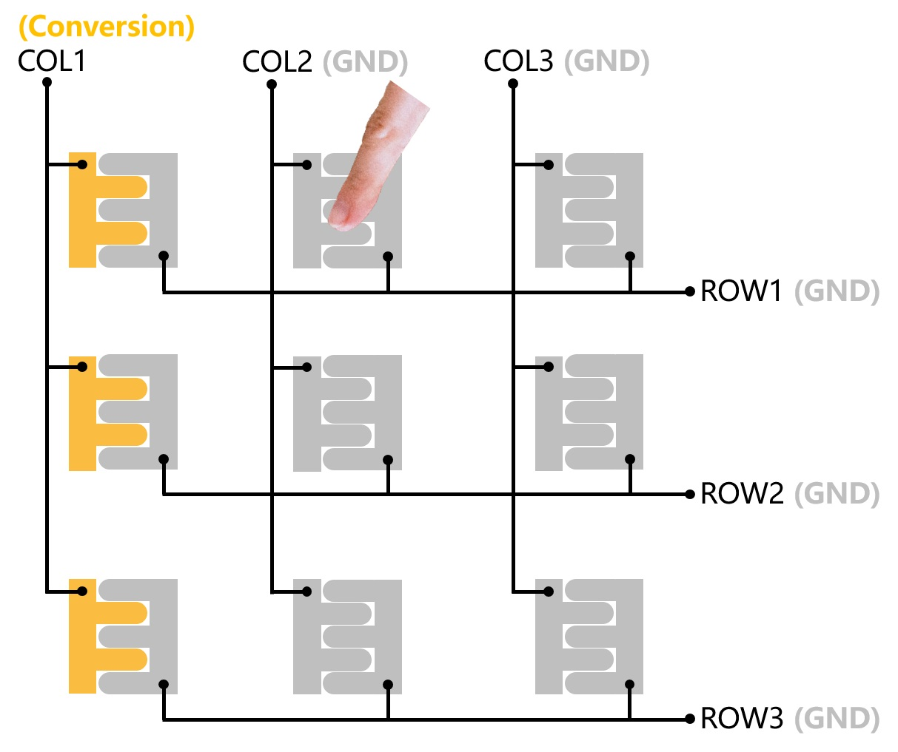

# Capacitive Touch Keyboard

### 1. Overview

This solution was first proposed by electronics enthusiast Ricardo. He wanted to design a capacitive touch keyboard PCB and print his business card on it. He chose to use CH582M for this solution and designed the PCB, but it has not been verified yet. So based on his solution, we upgraded the main control chip to CH585M and did actual verification. The PCB packages of CH585M and CH582M are the same, and they can be pin to pin compatible.

CH585M is a BLE chip that supports USB2.0 high/full/low speed, 14-channel TouchKey detection (supports up to 49 touch keys) and NFC. Compared with CH582M, CH585M upgrades the USB interface to high speed (480Mbps). TouchKey detection performance is stronger. The newly added NFC peripheral can simplify the BLE connection process. After the mobile phone scans NFC, it can directly connect to BLE, eliminating the tedious manual connection.

The work that has been completed so far is to verify the feasibility of the solution. Therefore, functions such as USB2.0 high speed and NFC have not yet been added. They will be upgraded in future versions.

### 2. Schematic

  

### 3. Layout

  

**Layout Notes:**

- **Signal Lines:**
1. The touch signal lines should be as short as possible.
2. It is recommended to use the minimum line width allowed by the PCB process. Generally, the minimum is 5mil and the maximum is no more than 10mil.
3. The spacing between adjacent signal lines should be kept at more than 3 times the line width. Otherwise, the interference between adjacent keys will increase, affecting the touch performance.
4. The routing should minimize corners. If it cannot be avoided, the corners should be 45&deg; or rounded.
5. The routing should avoid being close to high-frequency signal lines. If it cannot be avoided, the two should be routed vertically. If vertical routing is not possible, a ground wire needs to be added between the two.

- **Touch pad:**
1. Place the touch signal line on the back of the touch panel. Connect the touch signal line to the touch pad through a via. This can effectively reduce the probability of finger accidental touch. It is recommended that the vias be located at the edge of the touch pad to reduce the trace length.
2. If the touch signal line and the touch pad are not on the same layer, the signal line of other touch pads cannot be routed directly under the touch pad.
3. Do not lay copper directly below the touch pad (bottom layer). If copper needs to be laid on the touch pad layer (top layer), it is generally laid in a mesh pattern. The recommended distance between the touch pad or signal line and the ground is 1-2 mm.

### 4. Principle

  

The touch pad on the PCB and the nearby GND form a parasitic capacitance ***CP***. Due to the existence of human body capacitance, when a finger touches the pad, a capacitance ***CF*** is introduced, which increases the total capacitance. The total capacitance ***CT*** can be expressed as: ***CT = CP + CF***.

The size of the capacitance change ***CF*** caused is approximately between 0.1pF and 5pF. The size of ***CF*** is related to factors such as the finger contact area, the distance between the finger and the pad, and the dielectric constant of the medium between the finger and the pad.

  

As long as the same time is used to charge the pad capacitor, the ADC of the micro controller is used to collect the voltage value of the corresponding pad and compare it with the value when it is not touched. Then, the defined difference threshold can be used to identify whether the pad is touched.

  

This figure is a demonstration diagram of a 3*3 capacitive touch keyboard. Each pad consists of two parts, which are connected to two touch conversion channels respectively. Each touch conversion channel is connected to 3 pads. The connection directions are crossed to achieve a mesh pattern.

After the chip is powered on, it will obtain the touch conversion value of each pad when it is not touched as the reference value. Even if it is touched at this time, there is no problem, because this reference value will be updated after each scan, making it gradually approach the correct reference value.

  

At the beginning of each round of scanning, the software first sets the channel connected to the first column (COL1) to the touch conversion function. All other connected channels are set to push-pull output and output 0V. Then the touch conversion difference of the first column can be obtained. Then, in the same way, COL2, COL3, ROW1, ROW2, ROW3 are set to the touch conversion function, and the remaining channels are set to output 0V. The touch conversion difference of all channels can be obtained. When the touch conversion difference of a column channel and a row channel is greater than 0, it means that the intersection of this row and this column is touched.

### 5. Catalog Introduction

- **hardware**: This directory contains the schematics of capacitive touch keyboard
    - **CapTouchKeyboard_V1.1**: Schematic diagram of CH585M including BLE and USB interfaces

- **software**: This directory contains software DEMO for capacitive touch keyboard
    - **CapTouchKeyboard_V1.0**: Software DEMO of capacitive touch keyboard supporting BLE
        - **APP**: Files related to BLE HID keyboard communication and touch key processing
        - **HAL**: Hardware related files
        - **LIB**: BLE protocol stack related files
        - **Profile**: BLE HID keyboard service related files
        - **SRC**: 
            - **Ld**: link file, different projects use different link files
            - **RVMSIS**: Kernel system header files
            - **Startup**: Startup file, different projects use different startup files
            - **StdPeriphDriver**: Basic peripheral driver source files and header files
        - **TKYLIB**: Touch key library related files

### 6. Instructions

#### 6.1 Software Development

The IDE used to develop this project is [MounRiver Studio](http://www.mounriver.com/). The projects in the directory **software** can be directly opened with **MounRiver**. The compiled hex file is downloaded to the board through [WCHISPTool](https://www.wch-ic.com/downloads/WCHISPTool_Setup_exe.html).

#### 6.2 CH585 Programming

1. Use a jumper to short the BOOT and GND pins (①, PB22 pull-down).
2. Connect the keyboard to the PC via a USB cable (②). At this time, CH585 runs the Bootloader program, and the computer will recognize a USB device.
3. WCHISPTool will automatically recognize CH585 (③) and open the download interface.
4. Select the firmware in hex/bin format generated by the IDE (④). 
5. Click Download to program CH585 (⑤).

