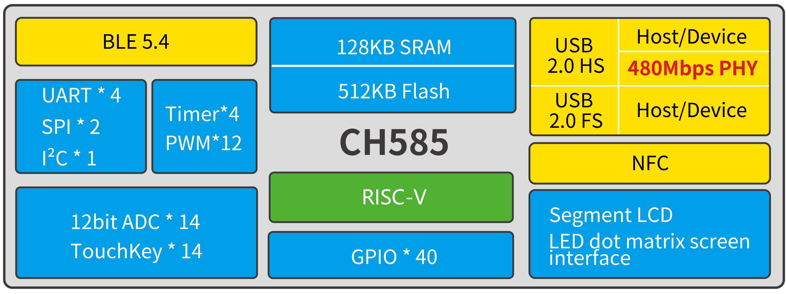
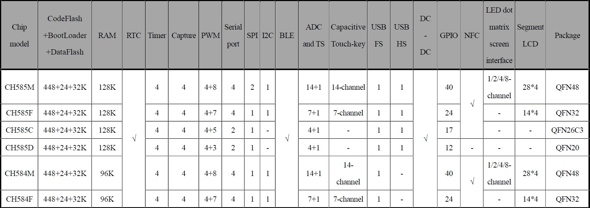

# RISC-V Core BLE5.4/2.4G/USB2.0-HS/NFC MCU - CH585

### Overview

CH585 is a RISC-V MCU microcontroller that integrates BLE wireless communication, high-speed USB and NFC. It integrates 2Mbps Bluetooth® Low Energy communication module, USB full-speed controller and transceiver, USB high-speed controller and transceiver (480Mbps), Near Field Communication (NFC) wireless interface, segment LCD driver module, LED dot matrix display interface, 2 SPIs, 4 UARTs, 14-channel ADC, touch-key detection module and other rich peripheral resources.

### System Block Diagram

### Features

 - QingKe RISC processor: RISC-V3C

 - Support RV32IMBC instruction set and self-extended instructions

 - 128KB SRAM, 512KB Flash

 - Support ICP, ISP and IAP, support OTA wireless upgrade

 - Integrated with 2.4GHz RF transceiver and baseband and link control

 - BLE complies with Bluetooth Low Energy 5.4 specifications

 - Support 2Mbps, 1Mbps

 - Receiving sensitivity -95dBm, programmable +4.5dBm transmission power.

 - Provide optimized protocol stack and application layer API
 
 - Support up to 8kHz polling rate in 2.4G mode

 - Built-in temperature sensor

 - Built-in RTC, supports timing and trigger modes

 - Built-in USB2.0 480Mbps high-speed and full-speed controller and transceiver, support host and device mode at high/full/low speed

 - Provide NFC wireless interface

 - Provide segment LCD controller interface, supports up to 112 dots (28*4) LCD panel

 - Provide LED dot matrix display interface, supports 1/2/4/8 data lines

 - Provide 4 UARTs, 12-channel PWM, 2 SPIs, and 1 IIC

 - Provide 14-channel TouchKey detection and 14-channel 12-bit ADC

 - 40 GPIOs, 2 of them support 5V signal input

 - Support minimum 1.7V power supply

 - AES-128 encryption and decryption, unique chip ID

 - Package: QFN48T, QFN32, QFN26C3

 ### Product Selection Guide

CH584 is simplified based on CH585. One set of USBHS and SPI1 are removed. RAM size is reduced to 96KB.